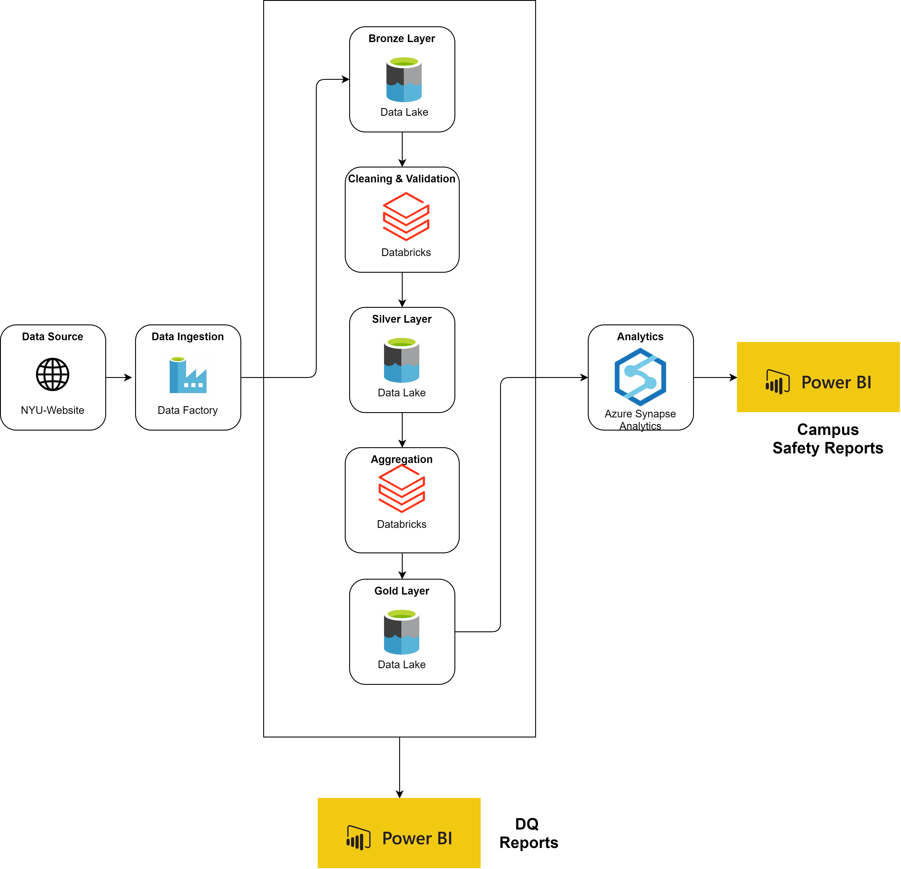
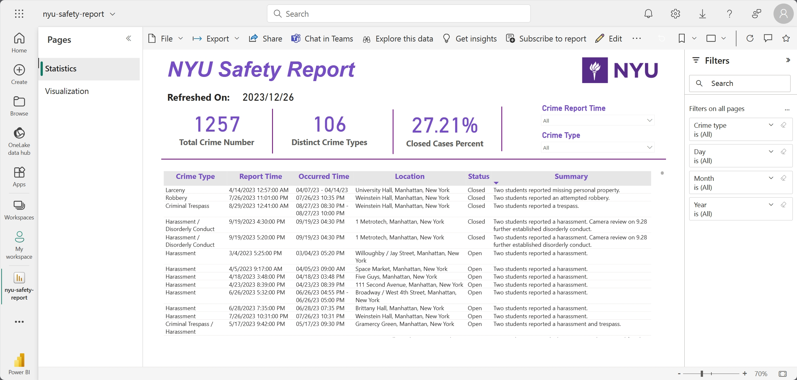
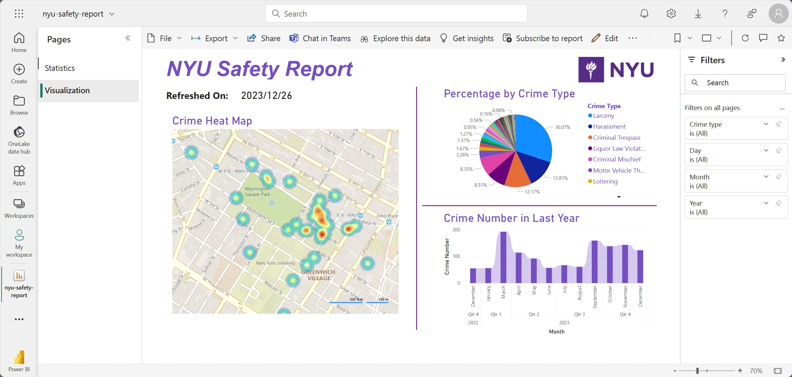

# Automated Campus Safety Report

In this project I am building an automated pipeline for the crime incidents happned in NYU campus. This helps us to gain insights in the time, spatical, and categorical partterns to evaluate the safety conditions around campus. 

## Project Architecture

The project architecture is as follow. We first injest the data using ADF, then the data would flow to Databricks where we have bronze/silver/gold layer to do the cleaning, validation, and tranformation. Then the data would go the azure synapse for analysis and then to power bi to create the final report with visualization. 

## Power BI Pages

